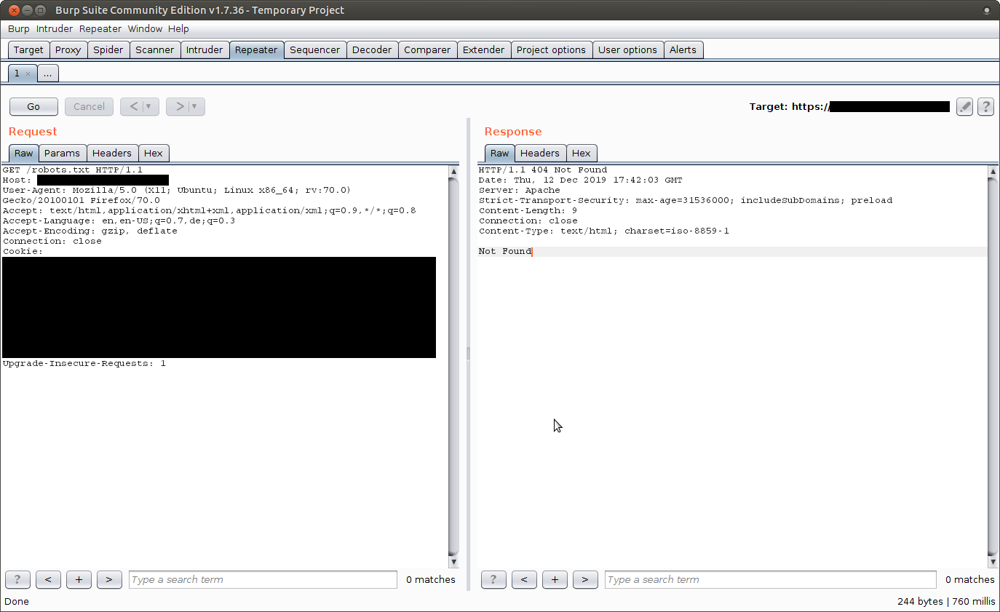
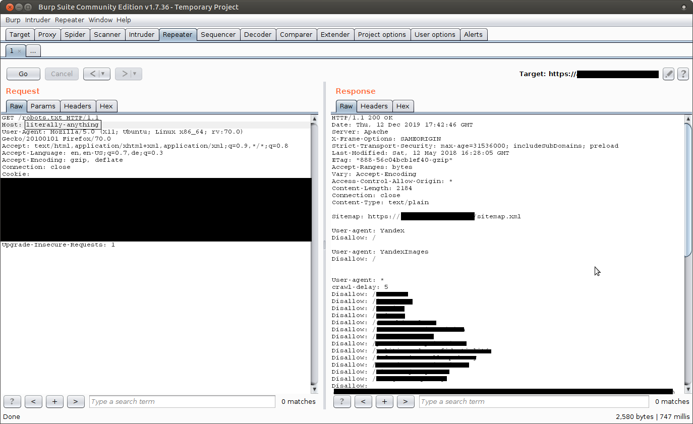
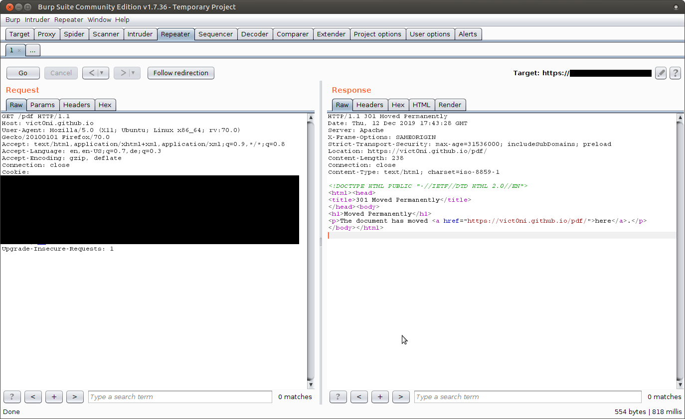

I was searching for bug bounty programmes by using [google dorks](https://github.com/sushiwushi/bug-bounty-dorks/blob/master/dorks.txt), when I came across one by a company, let's say, Example Inc. They had a ,relatively, big scope and I thought I'd give that a try.

After doing some recon and finding some interesting domains, I started playing with their API, https://api.example.com. Recently I learned more about Host Header Injections, so I thought maybe I'll start with that.
The API was working that way, so that the user has to provide a X-API-KEY header with the value of a valid API key. If the user didn't provide this header with a valid key, he would get a 403 response, i.e. Forbidden. I didn't have a valid key so, as mentioned earlier, I played with the Host header.

 To my surprise, setting the header to anything but the initial Host header value, would result to getting a 200 response, i.e. OK. Still, I couldn't use the API, but I could enumerate directories and access the (previously inaccessible) robots.txt file, where I could partially see the structure of the website. 

### *Before the injection*


### *After the injection*


Still, I was getting some 403 responses but the weird thing was that non existent directories would return a 200 response (I think the directory /vict0niIsTheBest doesn't exist, but still got me a 200 response). That way, I couldn't say if a directory that responded with a 200 really existed or not without looking at it's content.

The directories with Content-Length greater than 0 wasn't of any value. But I was getting some 301 responses too. Testing some directories with 301 response, I realized that, again, by changing the Host header I would get redirected to **any** website.



So my goal now was to find as many directories with 301 response as possible. I learned recently about a tool named [ffuf](http://burp/show/1/pw2mvovwqgzb13maiwxoc8s7ayaeq07a) so I gave that a try. 

```bash
ffuf -w big.txt -u "https://api.example.com/FUZZ" -H "Host: localhost" -o ~/Desktop/bugHunting/targets/example/ffuf_big_301.txt -mc 301
```

That way, I was able to find 10(!) Host header injection endpoints after getting access to them, yet with another Host header injection!
