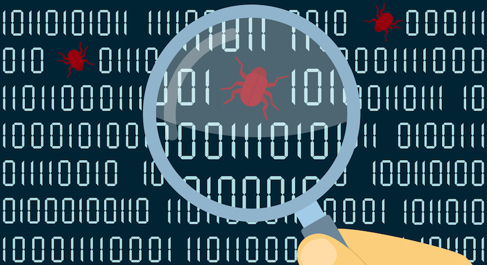

This is a write-up about a weird XSS vuln I found, that made me think I was losing my mind.



While doing some bug hunting on a website, I entered a XSS payload as a subdirectory in the URL, in order to see if and how it was reflected on the source code. For testing purposes I always use a payload with common XSS characters that are filtered in fear of triggering an XSS. After entering the

``https://website.com/"></>{}()vict0ni``

I got a custom 404 response page. Looking at the source code, the URL was reflected in 3 places. In the two of them the payload was sanitized, but on the third one everything were getting reflected as they were. The source code for the third reflection was something like this:

```
<input type="hidden" name="DismissCookieNotice" value="true" />
<input type="hidden" name="redirected" value="https://www.website.com/"></>{}()vict0ni" />
<input type="hidden" name="csrf" value=[something] />
```
So by entering the payload 

```https://website.com/"/><svg onload=alert(document.cookie)>``` 

an XSS was triggered.

So everything was really simple. I browsed the website a little bit just to see how it was structured and then I went back to retest the XSS, just to be sure. Only this time.. it didn't work.

After many tries of reproducing it, **I started to think I was *dreaming***. I tried to think what changed between now and the time I triggered the XSS. 
Then, after some tries, I thought re-entering the URL on a private session. That's where the XSS was triggered again. This happened because on the private session I didn't click "Accept Cookies" on the pop-up that now every website is forced to provide. But I did it while browsing the website **after** finding the XSS. I could have probably noticed that earlier in the **DismissCookieNotice** name in the source code.

The vulnerability was inside the code for the pop-up (after accepting, the page refreshed and the pop-up source code was missing from the new page)! So the XSS could be reproduced only ignoring the Cookie pop-up (not dismissing it, just by ignoring it).

The logic behind this pop-up was that after accepting the cookies, the website would redirect the user to the URL he already was. That's why the URL was reflected in the "redirect" hidden input. But they forgot to filter the input.

So next time you test for XSS, make sure to test it **before** you accept the cookies. You never know!
