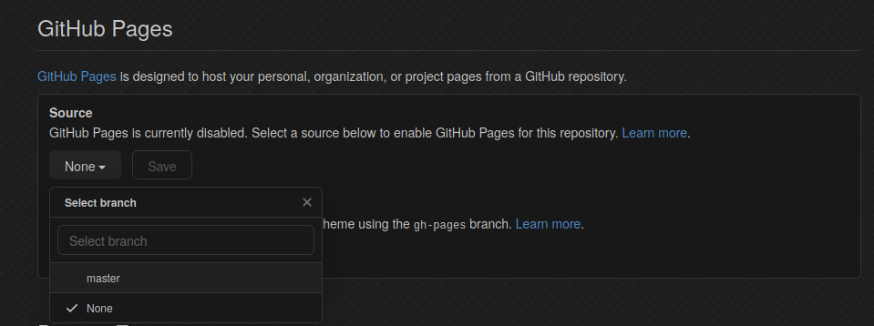

I have long been wating to "score" a subdomain takeover. It is a simple bug with a high impact, where the attacker can takeover the content of a subdomain of an organisation.

According to [acunetix](https://www.acunetix.com/vulnerabilities/web/hostile-subdomain-takeover/):
> One of the subdomains of the scanned domain is pointing to an external service but the external service account was cancelled or has expired. Because the account is not in use anymore, an attacker can claim this account and takeover your subdomain.

So, in simple words, a subdomain is vulnerable when the domain is pointing to an expired domain from an external service like Microsoft Azure, Heroku or (in our case) Github Pages. Creating the expired domain/account, you control the content of the original, vulnerable, subdomain.

You can read more about subdomain takeovers from these excellent articles:
[https://www.acunetix.com/vulnerabilities/web/hostile-subdomain-takeover/](https://www.acunetix.com/vulnerabilities/web/hostile-subdomain-takeover/)
[https://www.hackerone.com/blog/Guide-Subdomain-Takeovers](https://www.hackerone.com/blog/Guide-Subdomain-Takeovers)
[https://0xpatrik.com/takeover-proofs/](https://0xpatrik.com/takeover-proofs/)
[https://0xpatrik.com/subdomain-takeover-basics/](https://0xpatrik.com/subdomain-takeover-basics/)
[https://0xpatrik.com/subdomain-takeover-starbucks/](https://0xpatrik.com/subdomain-takeover-starbucks/)
[https://0xpatrik.com/subdomain-takeover/](https://0xpatrik.com/subdomain-takeover/)
[https://0xpatrik.com/subdomain-takeover-starbucks-ii/](https://0xpatrik.com/subdomain-takeover-starbucks-ii/)

## Github Pages Takeover:
While I was hunting for bugs on a target, I came across the subdomain api.example.com. The webpage's content was this:


This is a strong indication that the subdomain may be vulnerable to takeover. This message indicates that api.example.com points to a Github Pages subdomain, which is no longer valid. Another way to check this is to see what addresses the subdomain is pointing to, with the command

```bash
host api.example.com
```
or
```
nslookup api.example.com
```
This should result to addresses belonging to a third party service and in my case, Github. Unfortunately subdomain was behind Cloudflare so I couldn't see Github's addresses but the webpage's 404 message was good enough for me to test it. To succesfully create a PoC on Github Pages subdomain takover you have to do the following steps:

1. Create a repository with the name of the vulnerable subdomain (here: https://github.com/victoni/api.example.com)

2. Create a CNAME file with containing the domain name of the subdomain (here: api.example.com)

3. Create a file index.html with your PoC message

4. Go to Settings -> GitHub Pages -> Source -> master (or main) branch


There you will see the message "Your site is ready to be published at http://api.example.com"


It was a responsible disclosure program, so they thanked me for the help I provided and I got to execute my first subdomain takeover! Also, they invited me to "the group with the bug hunters to be closer and to help them in the best way", so kind of like a private invitation.