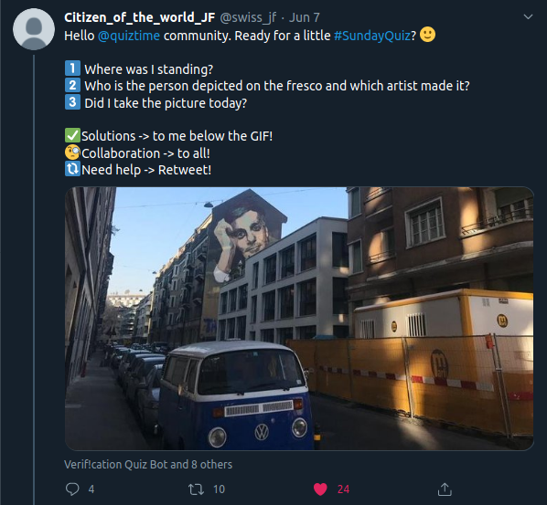

I recently found out that I **love** OSINT challenges. It's fascinating how much info you can find on the web just lying around. I love that you have to "join the dots" of different info to come to the truth. For those new to the term, OSINT is, according to wikipedia:

> Data collected from publicly available sources to be used in an intelligence context. In the intelligence community, the term "open" refers to overt, publicly available sources (as opposed to covert or clandestine sources). It is not related to open-source software or collective intelligence.

So it's basically all the information one can find about a target, using resources accesible by everyone. A target can be a person, a location (like in this challenge), an organization etc. While these days, the web is probably the biggest and most wide accesible resource, resources are not limited to it. Media like newspapers or television, books and academic papers are only a few of the available resources.

I recently discovered [this](https://twitter.com/quiztime) account on twitter. It posts everyday an OSINT challenge for you to solve. I'll admit it, sometimes the challs are easy to solve (a simple reverse image search and you're done) but sometimes it's something more than that. This challenge took me about 5 minutes to solve but it got me excited, nevertheless.

The challenge:

The photo:

For me, a standard move in those challenges is to save the picture and get it "tested" with Google Lens. Google Lens scans a picture you provide and gives you the information from whatever the app manages to recognise. In this case, the app focused on the blue mini van which is closer to the photographer. Google Lens gives you the option to focus on a specific part of a picture, so I cropped the photo and focused on the big graffiti. I thought that this can be used to identify the location.

Google Lens gave me back a lot of info. What caught my attention was a website, [ayatarek.com](https://www.ayatarek.com/). After visiting the website and going though it, I realized that this was the artist who [made this graffiti](https://www.ayatarek.com/omar-al-sharif-geneva/baor98910ufnxcj4a4rp1acira7x0j). The depicted person is [Omar al Sharif](https://en.wikipedia.org/wiki/Omar_Sharif), an egyptian film and television actor. Great, so we have the artist, the depicted person and the city (Geneva). Next objective is the exact location.

It seems that the saying "Google is your best friend" also counts for OSINT. A simple search for "geneva omar al sharif graffiti" took me to a Facebook post:

The post explains exactly where the graffiti is located. Searching in Google Eartg for the location `11 Jean Jaquet` took me to the exact location of the graffiti

The time as to when the photo was taken can be determined by the weather at that day. After some research, the weather in Geneva in the 7th of June was cloudy. Seeing that the weather in the picture is pretty sunny, I can deduce that the photo was taken earlier than the 7th of June.

There is a nice article in Secjuice about [leveraging street art in OSINT investigations](https://www.secjuice.com/street-art-in-osint-investigations/)