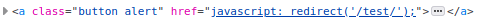
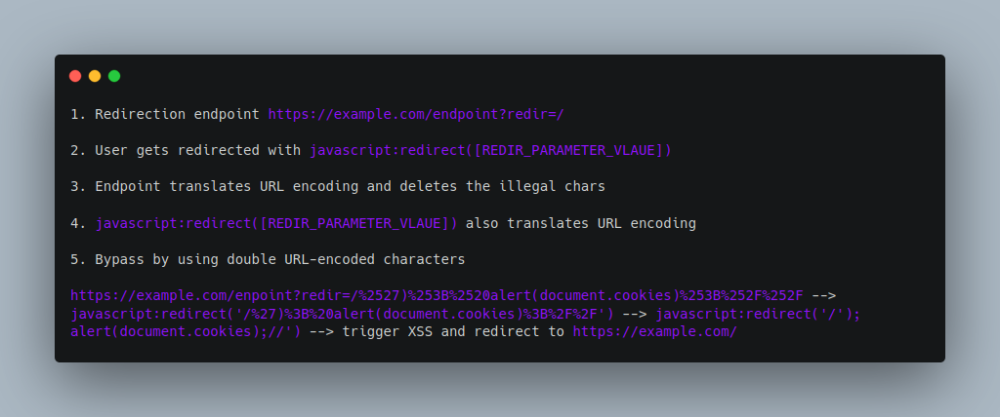

Right after the quarantine ended I had a mini burn out for more than a month, where I didn't even bothered to try and hunt for bugs. After those one and a half months of trying to find my motivation again, I discovered another two vulnerabilities on one program (well, actually the first one ended up being from a third party organisation). One of them was a XSS that required a bit more work than the usual `javascript:alert(1)` payloads.

Revisiting my old notes from a BB program, I observed an endpoint that I tried to exploit the last time, before I go through that burn out. Back then I wasn't able to exploit it, so now I thought I'd give it a second chance. The endpoint was `https://example.com/dir/legacy-browser?redir=/`. There was a button, where you would get redirected to the endpoint the paramteter `redir` was pointing. Analyzing the source code, I could see that the website was redirecting the user this way:

At first, I thought that this should be easy. I tried escaping the parenthesis by injecting `')` at the `redir` parameter. The result was that the illegal characters would be removed. Actually, if there was any illegal characters, the app would redirect you, by default, to `/`.

I tried to inject a null byte (`%00`), just to see how the app would react. The app translated the null byte into `NULL`. So the payload `redir=/%00/` would get reflected into the source code as `javascript:redirect('/NULL/')`. I thought great, the url encoded characters are getting translated. I clicked on the button and... I got redirected to `/NULL/`. Also, any other illegal url encoded character would be removed, just as I described previously.

So, apparently, the URL was getting decoded and sent to `javascript:redirect()` which was redirecting the user after they pressed the button. But I wanted to inject some "illegal" characters to escape the parenthesis. The only way to send illegal characters to `javascript:redirect()` was in a URL-encoded way, after they have been decoded from the URL bar. Hence, double URL-encoding!
I sent the second payload `https://www.gulp.de/gulp2/legacy-browser?redir=/%2500/test`, where `%2500` is the double URL-encoded null byte. The result was for `javascript:redirect('/%00/test')` to get reflected. After hitting the button, I got redirected to `https://example.com/`, meaning that the null byte was actually getting decoded. So I could actually send double URL-encoded payloads and they would get rendered.

Having this on my mind, I crafted a payload for this endpoint (and by crafting, I mean copying and pasting the XSS payload from [@brutelogic](https://twitter.com/brutelogic) in [PayloadAllTheThing](https://github.com/swisskyrepo/PayloadsAllTheThings/tree/master/XSS%20Injection) and adding a `')` in front). I double-URL-encoded it and injected it into the parameter. And after hitting the button, the XSS was getting triggered, right before the user get's redirected to `/`.

Final exploit: `https://example.com/enpoint?redir=/%2527)%253B%2520alert(document.cookies)%253B%252F%252F`

## tl;dr

